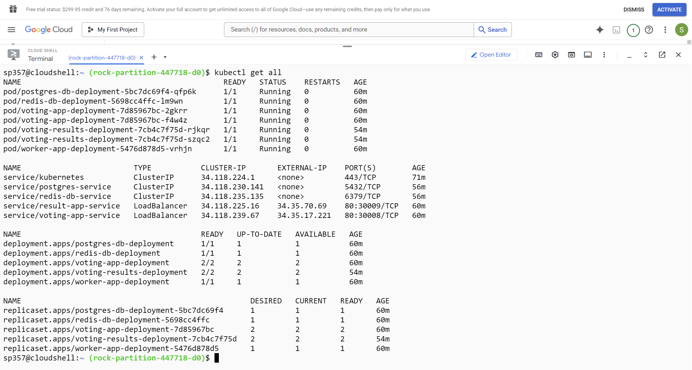
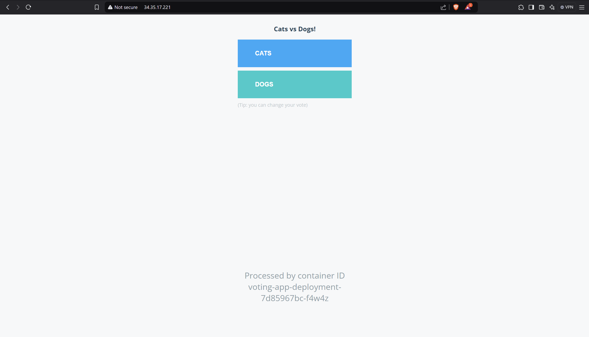
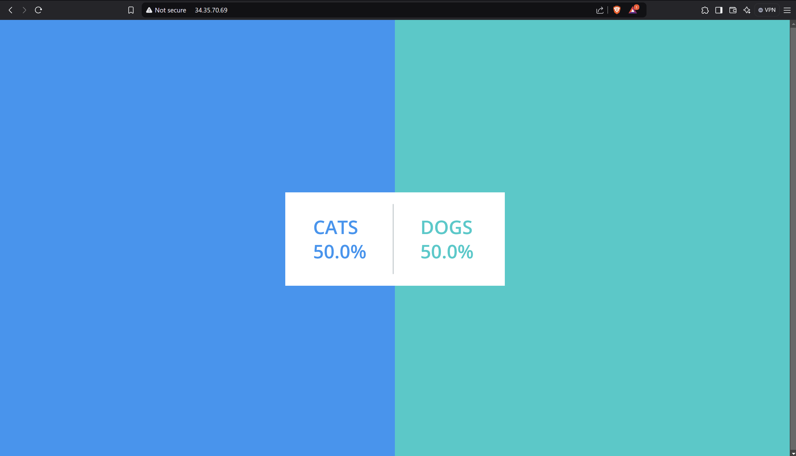

# Voting App Kubernetes Deployment

## Overview
This project demonstrates my knowledge of Kubernetes by deploying a multi-component Voting App on **Google Kubernetes Engine (GKE)**. The deployment includes multiple services, deployments, and secrets. While the website and database are **not connected**, the primary goal was to showcase Kubernetes resource management.

## Technologies Used
- **Kubernetes** (Deployments, Services, Secrets)
- **Google Kubernetes Engine (GKE)**
- **Docker** (Containerized applications)

## Project Structure
This project consists of the following Kubernetes resources:

### **1. Voting App**
- **Deployment**: `voting-app-deployment`
- **Service**: `voting-app-service` (LoadBalancer on port **80**)
- **Image Used**: `dockersamples/examplevotingapp_vote`

### **2. Result App**
- **Deployment**: `voting-results-deployment`
- **Service**: `result-app-service` (LoadBalancer on port **80**)
- **Image Used**: `dockersamples/examplevotingapp_result`

### **3. Redis Database**
- **Deployment**: `redis-db-deployment`
- **Service**: `redis-db-service` (ClusterIP on port **6379**)
- **Image Used**: `redis`

### **4. PostgreSQL Database**
- **Deployment**: `postgres-db-deployment`
- **Service**: `postgres-service` (ClusterIP on port **5432**)
- **Image Used**: `postgres`
- **Secrets Used**: `postgres-secret` (for database credentials)

### **5. Worker Application**
- **Deployment**: `worker-app-deployment`
- **Image Used**: `dockersamples/examplevotingapp_worker`

## Notes
🚨 The website and database are not connected, but this project serves as a demonstration of Kubernetes skills, particularly in managing deployments, services, and secrets.

## Screenshots

## Future Improvements
- Set up monitoring using Prometheus and Grafana.

